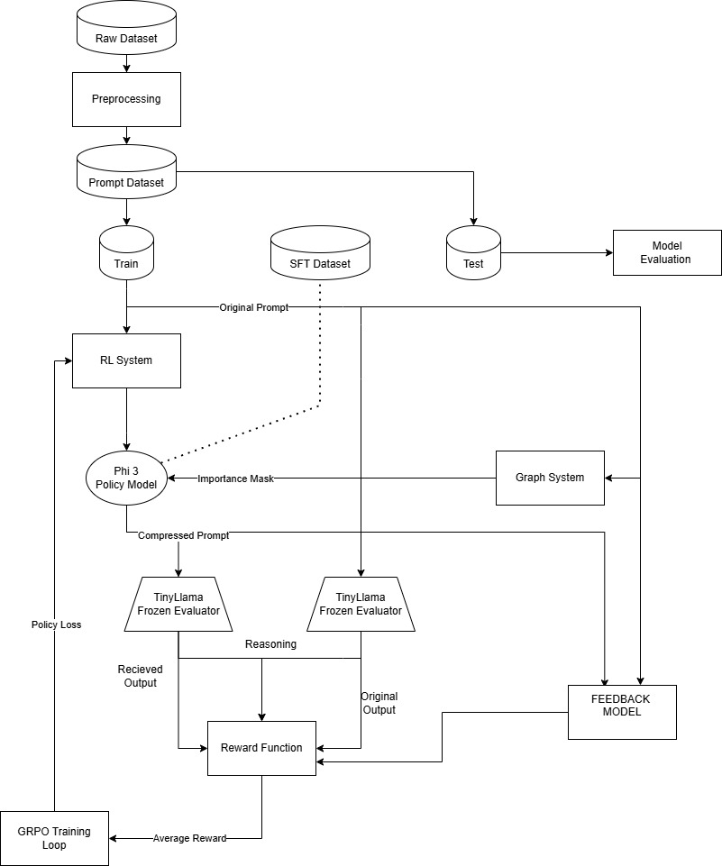

# 🧠 RL-Prompt-Compression

[]

## 📜 Overview

This repository implements a **Prompt Compression Framework** that optimizes large language model (LLM) efficiency by reducing input token length while preserving semantic and performance fidelity. The system leverages **Reinforcement Learning (RL)** and **Supervised Fine-Tuning (SFT)** for policy optimization.

---

## 🧩 System Architecture

Below is the high-level architecture of the RL-based Prompt Compression Framework.

### 1. Data Preparation
- **Raw Dataset:** Original prompt–response pairs collected from diverse domains.
- **Preprocessing:** Tokenization, cleaning, and formatting into model-compatible structures.
- **Prompt Dataset Split:** Divided into **Train** and **Test** sets for evaluation consistency.

### 2. Supervised Fine-Tuning (SFT)
- The model is first fine-tuned on high-quality prompt–response pairs to establish a baseline.
- This SFT phase “warms up” the policy, ensuring stability before RL optimization.

### 3. Reinforcement Learning System
- **Policy Model:** A lightweight LLM (*Phi-3*) generates compressed prompts.
- **Reward Function:** Evaluates compression quality using:
  - Fidelity to original meaning  
  - Compression ratio (token reduction)  
  - Preservation of downstream performance
- **Frozen Evaluator:** A fixed model (*TinyLlama*) used to assess reasoning ability on both original and compressed prompts.
- **GRPO Training Loop:** Gradient Regularized Policy Optimization refines the policy based on average reward feedback.

### 4. Feedback Mechanism
- The evaluator compares **Original Output** and **Received Output**.
- A **Feedback Model** adjusts reward signals dynamically.
- **Policy Loss** is computed and minimized through iterative updates.

### 5. Evaluation
- Measures token savings, semantic retention, and reward stability.

---

## ⚙️ Components

| Component | Description |
|------------|-------------|
| **Phi-3** | Policy model trained to generate compressed prompts. |
| **TinyLlama** | Frozen evaluator that scores both original and compressed prompts. |
| **Reward Function** | Quantifies the balance between compression and fidelity. |
| **Importance Mask Graph System** | Highlights tokens most critical for reasoning accuracy. |
| **GRPO Loop** | Core reinforcement optimization stage. |

---

## 🧪 Example

**Original Question:**
> A restaurant sold 80 pizzas on Friday, 110 on Saturday, and 130 on Sunday. What is the average number of pizzas sold per day over the weekend?

**Compressed Question (Generated):**
> A restaurant sold 80 on Friday, 110 on Saturday, and 130 on Sunday. What’s the average sold per day?

---

## 📈 Results

- **Token Reduction:** ~30–50% on average  
- **Performance Retention:** <3% degradation in reasoning accuracy  
- **Average Reward:** Improves steadily during training  

